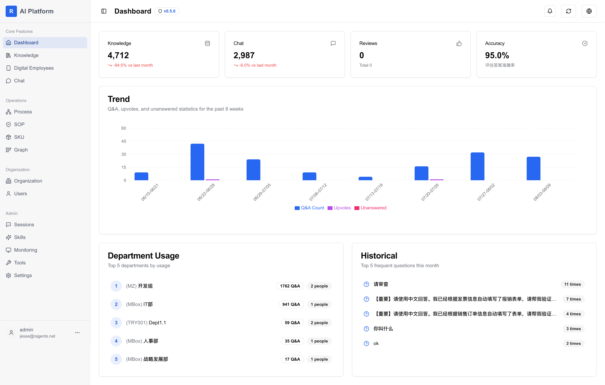

# RAgent AI Platform

An enterprise AI agent platform (智能体中台) built with Next.js. It lets organizations build and operate AI agent applications on top of their own knowledge and business processes — from RAG-powered knowledge bases and intelligent Q&A to visual workflow orchestration, process management, and multi-tenant administration.



<sub>The dashboard in v0.5.0, with Digital Employees and Skills in the sidebar.</sub>

## Core Features

- 🤖 **Digital Employees** — build, configure, and publish agent applications, including embeddable chatbots
- 📚 **Knowledge Base Management** — document upload, vector indexing, access control, RAG-powered Q&A with streaming responses
- 🔄 **Workflow Orchestration** — visual workflow editor for multi-step automation
- 📋 **Process Management** — business process trees, document review and revision flows, handbook generation
- 🧩 **Skills** — package instructions plus the scripts and files an agent needs, review them, and bind them to a digital employee; each user supplies their own credentials
- 🧰 **Tools** — MCP server registration and management. Native tools ship with the code and are authorized there, so there is nothing to bind for them
- 👥 **Multi-tenant Support** — organization management with a complete RBAC permission system
- 📄 **Document Preview & Editing** — Office file preview (kkFileView) and online editing (OnlyOffice)
- 📊 **Monitoring** — usage and license status dashboards
- 🌐 **i18n** — Simplified Chinese and English out of the box

## Skills

A skill is a knowledge package: instructions (`SKILL.md`) plus the scripts and files needed to
carry them out. The database is the single source of truth — nothing is read from the
filesystem at runtime — and the UI covers authoring, review, binding, and per-user credentials.

- **Draft and published are separate.** What runs is always the published snapshot, so editing
  a live skill cannot change behaviour until it is published again.
- **Executable skills run in a Docker sandbox** managed by `ragent-service`: no network unless
  the skill declares it needs one, read-only filesystem, dropped capabilities, non-root user,
  and memory/CPU limits. The command line written in `SKILL.md` is the command that runs —
  there is no translation layer.
- **Credentials belong to people, not the platform.** A skill declares which environment
  variables it needs via a `.env.example` asset; each user fills in their own values, injected
  per execution. Values are never returned by any endpoint, including to administrators, who
  see only which keys are set.
- **Skills can be written by talking.** A built-in skill-creator ships with the platform. Bind
  it to a digital employee and you can ask for a skill in plain language instead of starting
  from a blank editor. It drafts the body, writes scripts, configures the sandbox and submits
  for review — but approval stays a human action, and a draft's scripts are not in the
  executable set until someone approves them. The built-in skill itself cannot be edited or
  deleted by anyone, since it is versioned with the code and any change would be overwritten
  on the next release.

> ⚠️ **Deployment requirement.** Skill *execution* needs the `ragent-service` process to be
> able to run `docker`. If the backend itself runs in a container, that container needs the
> Docker CLI and a mounted socket — otherwise skills can be authored, reviewed and bound, but
> every execution fails. Authoring works without it; running does not.

## Agent prompts

A digital employee's system prompt lives in its **Agent.md**, edited on the employee's own
page. That is the only place it lives.

The standalone prompt library was removed in v0.5.0. Existing prompts had already been copied
into the corresponding Agent.md verbatim, and nothing reads the old records at runtime.

## Architecture

This repository is the **web frontend**. A full deployment consists of:

| Service | Role | Configured via |
|---|---|---|
| ragent (this repo) | Next.js web app + API routes | — |
| ragent-service | FastAPI backend (RAG pipeline, LLM calls, skill sandbox) | `EXTERNAL_API_BASE_URL` |
| PostgreSQL + pgvector | Data and vector storage | `DATABASE_URL` |
| OnlyOffice Document Server | Online editing, docx→PDF conversion | `ONLYOFFICE_INTERNAL_URL`, `ONLYOFFICE_JWT_SECRET` |
| kkFileView | File preview | `KKFILEVIEW_BASE_URL` |
| markdown-to-pdf | PDF report generation | `PDF_SERVICE_URL` |

The auxiliary services are wired together in `docker/docker-compose.yml` (production) and `docker/docker-compose.dev.yml` (development).

## Tech Stack

- **Frontend**: Next.js 15, React 19, Tailwind CSS, Radix UI
- **Backend**: Next.js API routes, PostgreSQL (pgvector)
- **AI**: OpenAI-compatible embeddings, multiple LLM providers via ragent-service

## Quick Start

### Prerequisites

- Node.js 20+ and pnpm
- PostgreSQL with the [pgvector](https://github.com/pgvector/pgvector) extension
- Docker (optional, for the auxiliary services)

### Environment Setup

```bash
cp env.example .env
# Edit .env — see inline comments in env.example for every variable
```

Required variables (the app fails fast when they are missing instead of falling back to insecure defaults):

- `DATABASE_URL` — PostgreSQL connection string
- `JWT_SECRET` — session token signing key. **Must be identical to `JWT_SECRET_KEY` in ragent-service**, otherwise logins are rejected with 401
- `ONLYOFFICE_JWT_SECRET` — required by the OnlyOffice-related API routes; must match the `JWT_SECRET` passed to the OnlyOffice container

### Local Development

```bash
pnpm install
pnpm dev
```

### Tests & Checks

```bash
pnpm test        # node --test (needs Node >= 22.6 for type stripping)
pnpm check:ci    # biome lint + format check
```

## Deployment

For detailed instructions see [deploy/README.md](./deploy/README.md).

```bash
# PM2 deployment
./deploy/start.sh

# Docker deployment (pulls image and starts the compose stack)
./deploy/start-docker.sh

# Pin the running image to a specific build tag (short git SHA)
./deploy/pull-tag.sh <tag>

# Roll back to a previous image
./deploy/rollback.sh
```

## Project Structure

```
app/          # Next.js App Router pages and components
pages/api/    # API routes (auth, knowledge, chat, internal services)
lib/          # Shared server-side logic (db, auth, document versions…)
hooks/        # Client-side data hooks (one per resource: skills, tools, reviews…)
components/   # Shared UI components
messages/     # i18n resources (zh-CN, en)
docker/       # Compose files for the full service stack
deploy/       # Deployment scripts
scripts/      # Data import / maintenance scripts
```

## Author

squarezw
www.ragents.net
